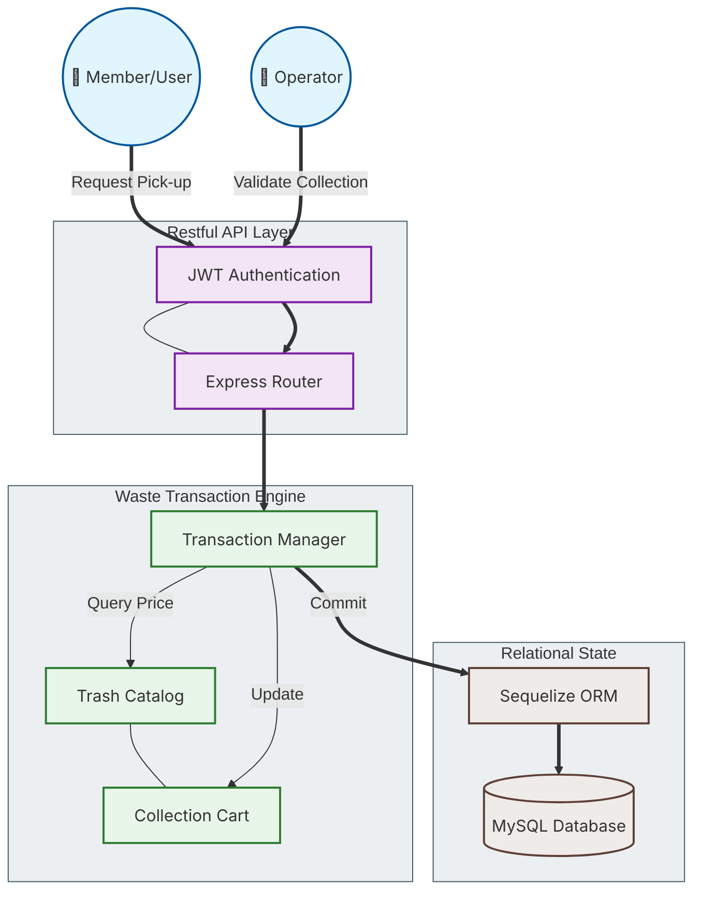

# ♻️ Prototype: KALPATARU (Digital Waste Management & Circular Economy)

## 📌 Project Overview
**KALPATARU** is a digital transformation initiative designed to bridge the gap between waste management and the circular economy. This prototype demonstrates a robust backend architecture for managing a community-driven waste collection system, where waste is treated as a tradeable commodity through a transparent transaction ledger.

The project aligns with the **Sovereign Systems** narrative by empowering local communities to manage their resources and sustainability data independently, ensuring economic value is returned directly to the participants.

---

## 🏗️ System Architecture (Circular Economy Flow)

### 📋 Diagram Legend (System Functional Mapping)
| Symbol/Style | Description | Classification |
| :--- | :--- | :--- |
| **Double Circle (( ))** | System Actors (Members & Operators) | **Actors** |
| **Rectangle [ ]** | API Endpoints and Functional Modules | **Component** |
| **Cylinder [( )]** | Persistent Relational Data (MySQL) | **Data Store** |
| **Bold Line (==>)** | Transactional & Financial Data Flow | **Primary Relation** |
| **Thin Line (---)** | Informational or Catalog Lookups | **Association** |
| **Blue Box** | User Interaction & Security Layer | **Access Layer** |
| **Purple Box** | Core API & Routing Middleware | **Orchestration** |
| **Green Box** | Waste Processing & Financial Logic | **Business Layer** |

---

## 🚀 Key Components & Logic

### 1. The Economy: Trash Catalog & Pricing
Waste is categorized (e.g., Plastic, Paper, Metal) with dynamic pricing. The system treats each collection as a financial transaction, converting physical waste weight into digital credits for the user.

### 2. The Ledger: Transaction Manager
A strict relational model handles the lifecycle of a waste transaction:
- **Carts:** Temporary storage for pending collections.
- **Transactions:** Finalized records linking members, operators, and specific trash items.
- **Details:** Granular logging of weights and individual item valuations.

### 3. Security: Role-Based Access Control (RBAC)
Using JWT (JSON Web Tokens) and Bcrypt, the system distinguishes between **Members** (who submit waste) and **Operators** (who verify and process waste). This ensures data integrity and prevents unauthorized financial claims.

---

## 🛡️ Sustainability Workflow

1.  **Collection:** A Member gathers waste and requests a pickup/drop-off.
2.  **Valuation:** An Operator weighs the waste and inputs it into the system via the "Cart".
3.  **Settlement:** The system calculates the total value based on the current Trash Catalog.
4.  **Commitment:** A Transaction is generated, updating the Member's balance and the Operator's ledger.
5.  **Audit:** All historical transactions are available for reporting and environmental impact analysis.

---

## 🛠️ Tech Stack Employed

| Layer | Technologies |
| :--- | :--- |
| **Backend Framework** |   |
| **Database & ORM** |   |
| **Authentication** |   |
| **Infrastructure** |   |
