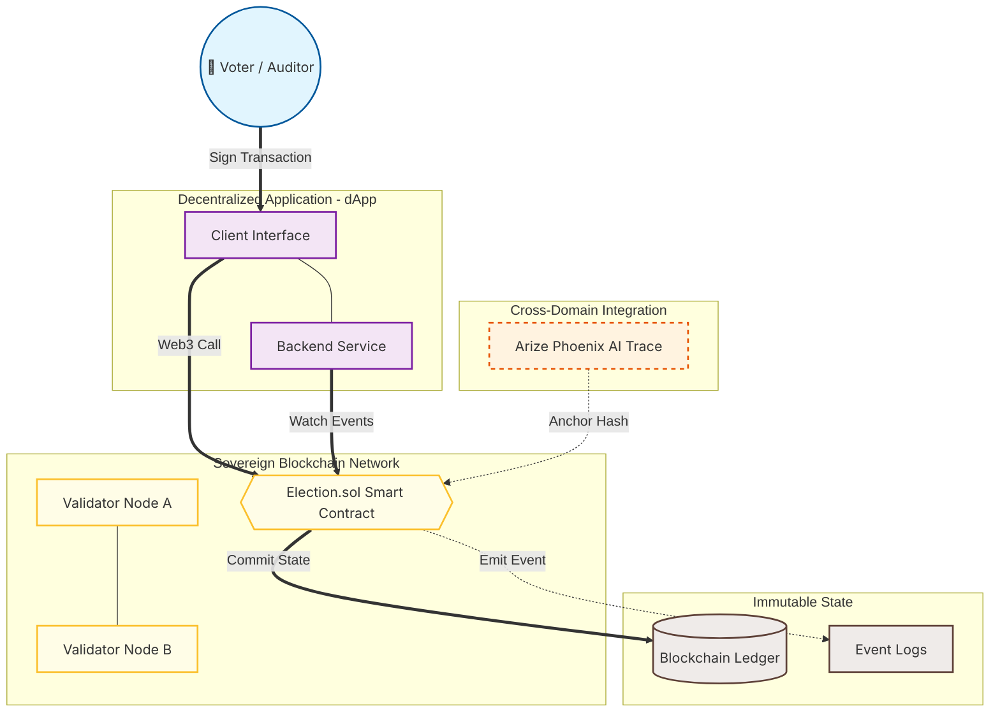

# ⛓️ Prototype: Sovereign Immutable Audit Ledger (Blockchain)

## 📌 Project Overview
This prototype demonstrates the integration of **Blockchain technology** as the ultimate "Truth Layer" for a sovereign digital environment. While the AI Governance stack manages intelligence and observability, this Blockchain layer ensures that all critical system actions, audit logs, and election-grade decisions are recorded on an **Immutable Distributed Ledger**.

The goal is to eliminate "Administrative Tampering" by ensuring that once a governance event (like an AI-audited decision or a vote) is recorded, it can never be altered or deleted, providing 100% mathematical proof of integrity.

---

## 🏗️ System Architecture (Blockchain Integration)

### 📋 Diagram Legend (Blockchain Standards)
| Symbol/Style | Description | Classification |
| :--- | :--- | :--- |
| **Double Circle (( ))** | End User or External Auditor with Private Key | **Actor** |
| **Hexagon {{ }}** | Smart Contract (Solidity) Logic & Rules | **Smart Contract** |
| **Cylinder [( )]** | Immutable Ledger / Block Storage | **Distributed Store** |
| **Yellow Box** | Distributed Validator Network | **Consensus Layer** |
| **Purple Box** | dApp Business Logic & API Bridge | **Application Layer** |
| **Orange Box (Dashed)** | External AI Trace Data being "Anchored" | **Governance Bridge** |

---

## 🚀 Key Components & Logic

### 1. The Trust Layer: Smart Contracts (`Election.sol`)
All rules are hard-coded into Solidity. 
- **Ownership:** Only the `owner` can start sessions or authorize voters.
- **Integrity:** Once a vote or an audit hash is submitted, the state is locked.
- **Transparency:** Anyone with network access can verify the results without trusting a central database.

### 2. The Bridge: AI-to-Blockchain Anchoring
This is the core of the "Sovereign Stack." 
- When **OpenClaw** makes a decision, **Arize Phoenix** generates a unique `Trace ID`.
- This ID is hashed and sent to the Blockchain via a transaction.
- **Benefit:** You can prove *exactly* what the AI did at a specific timestamp by matching the Blockchain record with the local Phoenix logs.

### 3. Decentralized Identity (Voter Authorization)
Instead of a simple username/password, users are authorized via their **Public Address**. This ensures that only identity-verified nodes within the **Tailscale/Zero-Trust** network can interact with the ledger.

---

## 🛡️ Immutable Audit Workflow

1.  **Action:** A critical system change or a vote is initiated.
2.  **Validation:** The Smart Contract checks the `onlyOwner` or `pemilihTerotorisasi` status.
3.  **Consensus:** The validator nodes reach consensus on the transaction.
4.  **State Change:** The ledger is updated, and an `Event` is emitted.
5.  **Proof:** The user receives a transaction hash, which serves as a permanent, undeniable receipt of their action.

---

## 🛠️ Tech Stack Employed

| Layer | Technologies |
| :--- | :--- |
| **Blockchain** |    |
| **Backend/Bridge** |    |
| **Security** |   |
| **Infrastructure** |   |
