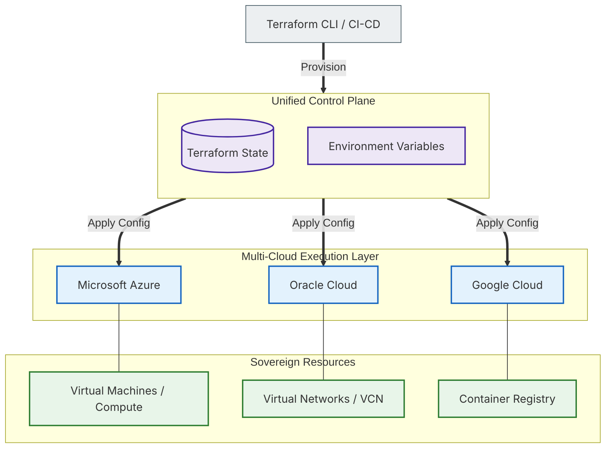

# 🌐 Prototype: Sovereign Infrastructure (Multi-Cloud Orchestration)

## 📌 Project Overview
This prototype demonstrates the implementation of **Sovereign Infrastructure**, a paradigm where digital resources are distributed across multiple cloud providers (Azure, OCI, AWS, GCP) while maintained under a single, unified control plane.

The goal is to eliminate "Vendor Lock-in" and ensure high availability by treating cloud providers as interchangeable utility nodes. This architecture emphasizes **Infrastructure-as-Code (IaC)** and automated provisioning to maintain a consistent state across a distributed global footprint.

---

## 🏗️ System Architecture (Distributed Control Plane)

### 📋 Diagram Legend (IaC & Provisioning)
| Symbol/Style | Description | Classification |
| :--- | :--- | :--- |
| **Rectangle [ ]** | Infrastructure Modules or Cloud Providers | **Provider/Service** |
| **Cylinder [( )]** | Terraform State Persistence | **State Store** |
| **Bold Line (==>)** | Provisioning and Lifecycle Management | **Orchestration** |
| **Thin Line (---)** | Resource Association | **Dependency** |
| **Purple Box** | Unified Logic & Variables | **Control Plane** |
| **Blue Box** | External Cloud Ecosystems | **Execution Layer** |
| **Green Box** | Deployed Sovereign Assets | **Resource Layer** |

---

## 🚀 Key Components & Logic

### 1. The Orchestrator: Terraform
Terraform acts as the "Source of Truth" for the entire infrastructure. By using a modular design, the system can deploy identical network topologies and compute clusters across different clouds simultaneously.

### 2. State Management & Consistency
The **Terraform State** ensures that the actual infrastructure matches the desired state defined in code. This allows for rapid scaling, disaster recovery, and consistent security patching across the multi-cloud environment.

### 3. Resource Abstraction
Cloud-specific complexities (like Azure VNets vs. OCI VCNs) are abstracted into high-level Terraform modules. This allows the architect to focus on system design rather than provider-specific nuances.

---

## 🛡️ Provisioning Workflow

1.  **Code:** Define the desired infrastructure in HCL (HashiCorp Configuration Language).
2.  **Plan:** Terraform generates an execution plan, showing exactly what will be created, modified, or destroyed.
3.  **Apply:** The Control Plane communicates with Cloud APIs (Azure, OCI, etc.) to provision resources.
4.  **Sync:** Terraform updates the state file to reflect the live environment.
5.  **Audit:** Every infrastructure change is version-controlled via Git, providing a complete audit trail of the system's evolution.

---

## 🛠️ Tech Stack Employed

| Layer | Technologies |
| :--- | :--- |
| **IaC Orchestration** |   |
| **Cloud Providers** |    |
| **Containerization** |   |
| **Configuration** |   |
