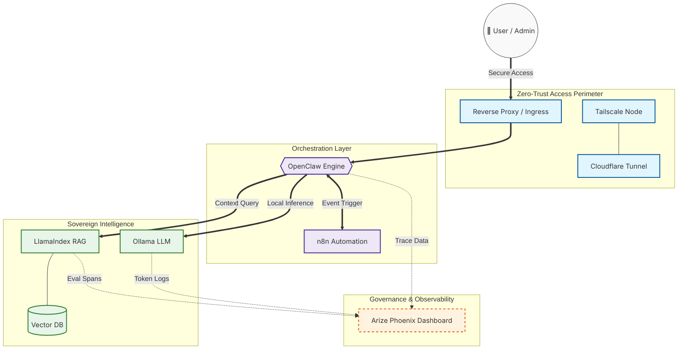

# 🛠️ Prototype: Unified Sovereign AI Governance Stack

## 📌 Project Overview
This prototype demonstrates a fully self-hosted, private, and auditable AI orchestration environment. It bridges the gap between raw local intelligence and enterprise-grade governance by unifying orchestration, context management, and observability into a single sovereign perimeter.

The goal is to provide a "Private Intelligence Center" where data never leaves the controlled infrastructure, and every AI decision is traced and evaluated for compliance and accuracy.

---

## 🏗️ System Architecture

### 📋 Diagram Legend (Standard Architecture Mapping)
| Symbol/Style | Description | Classification (ISO/C4) |
| :--- | :--- | :--- |
| **Double Circle (( ))** | External Actor (User, Admin, or External Trigger) | **Person** |
| **Hexagon {{ }}** | Decision Engine / Logic Controller (OpenClaw) | **Component** |
| **Cylinder [( )]** | Data Persistence Layer (Vector Database) | **Container (Store)** |
| **Bold Line (==>)** | Primary Data Flow (Requests & Inference) | **Primary Relation** |
| **Dashed Line (-.->)** | Secondary Flow (Audit, Traces, Eval Metadata) | **Dependency / Trace** |
| **Blue Box** | Security & Access Management Layer | **Infrastructure** |
| **Purple Box** | Core System Orchestration | **Logic Layer** |
| **Green Box** | Local Intelligence & RAG System | **Intelligence Layer** |
| **Orange Box** | System Compliance & Observability | **Governance Layer** |

---

## 🚀 Key Components & Logic

### 1. The Brain: OpenClaw
Acts as the central nervous system. It manages agentic workflows, deciding when to search the local knowledge base or trigger an external automation. It ensures that LLM interactions follow predefined safety and logic bounds.

### 2. The Engine: Ollama
Provides the raw inference power using local models like **DeepSeek-R1** or **Qwen-2.5**. By running Ollama within the same network, we eliminate latency and data privacy risks associated with third-party APIs.

### 3. The Memory: LlamaIndex
Provides "Context Sovereignty." It indexes private documents (PDFs, Markdown, Wikis) into a local vector database. When a query is made, LlamaIndex injects only the relevant private context into the prompt, ensuring the LLM remains grounded in factual, private data.

### 4. The Auditor: Arize Phoenix
This is the "Governance" anchor. It records every trace, span, and retrieval step. 
- **Audit:** Who asked what, and what context was retrieved?
- **Evaluation:** Did the LLM hallucinate? Was the retrieved context relevant?
- **Sovereignty:** Unlike SaaS alternatives, Phoenix runs locally, keeping the audit trail private.

### 5. The Connector: n8n
Handles the "External World" integration. It acts as the sensor and actuator, pulling data from GitHub, SQL databases, or internal APIs and feeding it into the OpenClaw orchestration loop.

---

## 🛡️ Governance Workflow

1.  **Request:** A user or an n8n trigger sends a request to OpenClaw.
2.  **Context Retrieval:** OpenClaw asks LlamaIndex for relevant private data.
3.  **Inference:** OpenClaw sends the prompt + context to Ollama.
4.  **Tracing:** Throughout the process, Arize Phoenix captures the metadata (Prompts, Token usage, Retrieval accuracy).
5.  **Validation:** Arize Phoenix runs automated Evals to ensure the response is safe and accurate before it is delivered.
6.  **Response:** The final, audited answer is sent back to the user/trigger.

---

## 🛠️ Tech Stack Employed

| Layer | Technologies |
| :--- | :--- |
| **Orchestration** |   |
| **Intelligence** |   |
| **Governance** |  |
| **Infrastructure** |     |
| **Security** |   |
