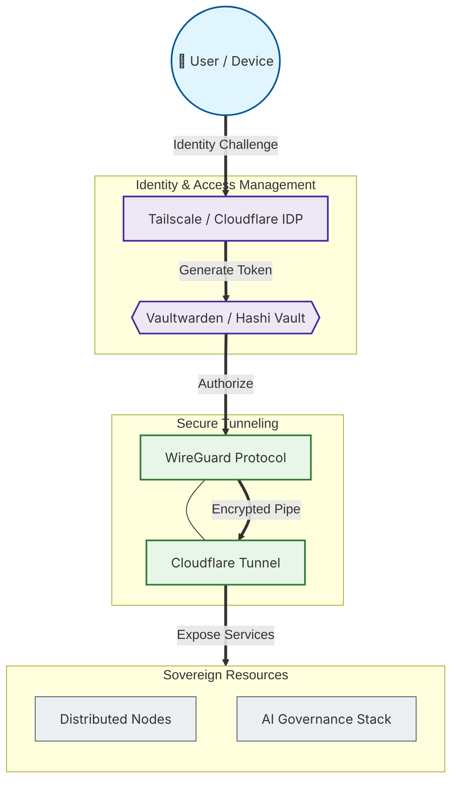

# 🛡️ Prototype: Zero-Trust Networking (Perimeter-less Access)

## 📌 Project Overview
This prototype demonstrates the implementation of a **Zero-Trust Network**, where access to resources is granted based on verified identity and device health rather than physical location. This model eliminates the concept of a "trusted internal network," ensuring that every request—regardless of origin—is strictly authenticated and authorized.

The architecture focuses on creating a secure, identity-aware perimeter that protects distributed nodes and AI services across the global Sovereign Infrastructure.

---

## 🏗️ System Architecture (Identity-Aware Perimeter)

### 📋 Diagram Legend (Security Principles)
| Symbol/Style | Description | Classification |
| :--- | :--- | :--- |
| **Double Circle (( ))** | Authenticated User or Device | **Person** |
| **Hexagon {{ }}** | Secrets Management & Credential Store | **Security Controller** |
| **Rectangle [ ]** | Networking Protocols and IDPs | **Network Component** |
| **Bold Line (==>)** | Encrypted & Authenticated Traffic | **Secure Flow** |
| **Thin Line (---)** | Protocol Peering | **Association** |
| **Purple Box** | Identity & Secret Verification Layer | **Trust Control** |
| **Blue Box (Nodes)** | Encryption & Tunneling Layer | **Network Fabric** |
| **Green Box** | Final Protected Resource Layer | **Service Layer** |

---

## 🚀 Key Components & Logic

### 1. Identity over Location
Instead of IP-based security, the system uses **Tailscale** (WireGuard-based) to create an encrypted mesh network where every node has a unique, verifiable identity. This ensures that a compromised node cannot easily move laterally through the network.

### 2. Secret Sovereignty: Vaultwarden
Secrets, API keys, and certificates are managed centrally through **Vaultwarden**. This ensures that sensitive data is never hard-coded into the infrastructure and can be rotated automatically within the Zero-Trust perimeter.

### 3. Edge Security: Cloudflare Tunnel
Public-facing services are exposed securely through **Cloudflare Tunnels**. This eliminates the need for open inbound ports on the server, effectively hiding the infrastructure from the public internet while allowing authenticated access.

---

## 🛡️ Zero-Trust Workflow

1.  **Identity:** The User/Device authenticates with the Identity Provider (IDP).
2.  **Encryption:** Tailscale/WireGuard establishes an end-to-end encrypted tunnel.
3.  **Authorization:** The system checks the Access Control Policy (ACL) in Vaultwarden/Tailscale.
4.  **Least Privilege:** Access is granted *only* to the specific service requested (e.g., the AI Governance Dashboard).
5.  **Monitoring:** All access events are logged for audit and security analysis.

---

## 🛠️ Tech Stack Employed

| Layer | Technologies |
| :--- | :--- |
| **Connectivity** |   |
| **Public Ingress** |   |
| **Secrets Management**|   |
| **Infrastructure** |   |
