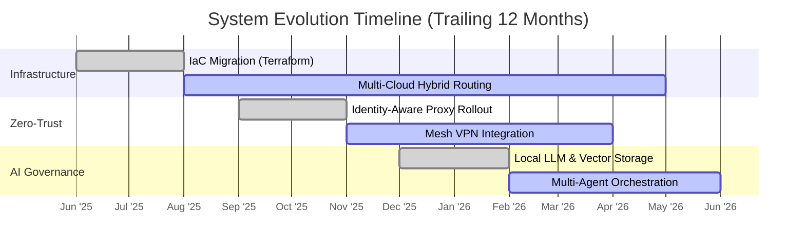

---
# 🏛️ Systems Architecture & Infrastructure Hub

> **Core Focus:** Sovereign Systems, Zero-Trust Architecture (ZTA), and Applied AI Governance.
> *Metrics are synced asynchronously via operational telemetry.*

This repository outlines the architectural blueprints, operational standards, and active states of a distributed infrastructure. The design philosophy strictly adheres to data sovereignty, perimeter-less security, and observable systems.

---

## 📡 Live Telemetry & System Evolution

The following metrics represent the current distribution of architectural complexity across active environments.

  
  
  

---

## 🏗️ Architectural Pillars

The ecosystem is structured around three primary capabilities, documented via the C4 model.

### 1. Sovereign Infrastructure (Multi-Cloud & Edge)
Avoiding vendor lock-in through distributed design.
- **Topology:** Hybrid deployments spanning isolated VMs and Edge compute nodes.
- **State Management:** Fully reproducible environments via Terraform, utilizing distributed KV stores for dynamic configuration.

### 2. Zero-Trust Architecture (ZTA)
Assuming compromise at the network layer. Every internal and external request is explicitly verified.
- **Routing:** 100% reliance on secure tunnels and service bindings (no public ingress ports).
- **Identity:** Authorization is handled at the edge via SSO and dynamic, database-backed whitelists.

### 3. AI Governance & Orchestration
Secure frameworks for AI integration, ensuring context isolation.
- **Data Flow:** Strict segregation between operational data and LLM inference pipelines.
- **Execution:** Hybrid model combining local inference for privacy-sensitive tasks and external APIs for fallback reasoning.

---
*Generated asynchronously. Verified by system audit: March 2026.*
