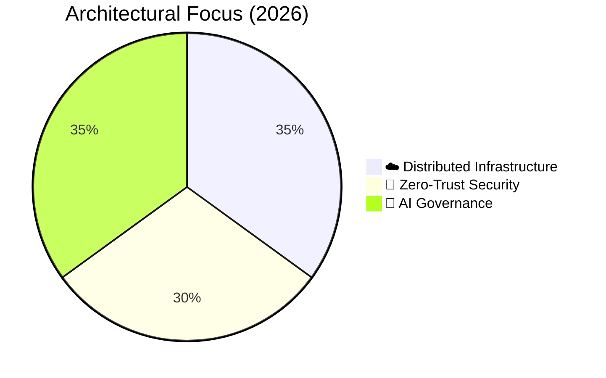

# 🏛️ Sovereign System & AI Governance Architecture

### Core Specializations
- **Sovereign Infrastructure:** Multi-cloud systems managed via IaC (Terraform) across distributed nodes.
- **Zero-Trust Networking:** Identity-aware, perimeter-less access model via Cloudflare Access and secure tunnels.
- **AI Governance:** Private agent orchestration and automated system auditing with strict context isolation.

## 📊 Infrastructure Focus

